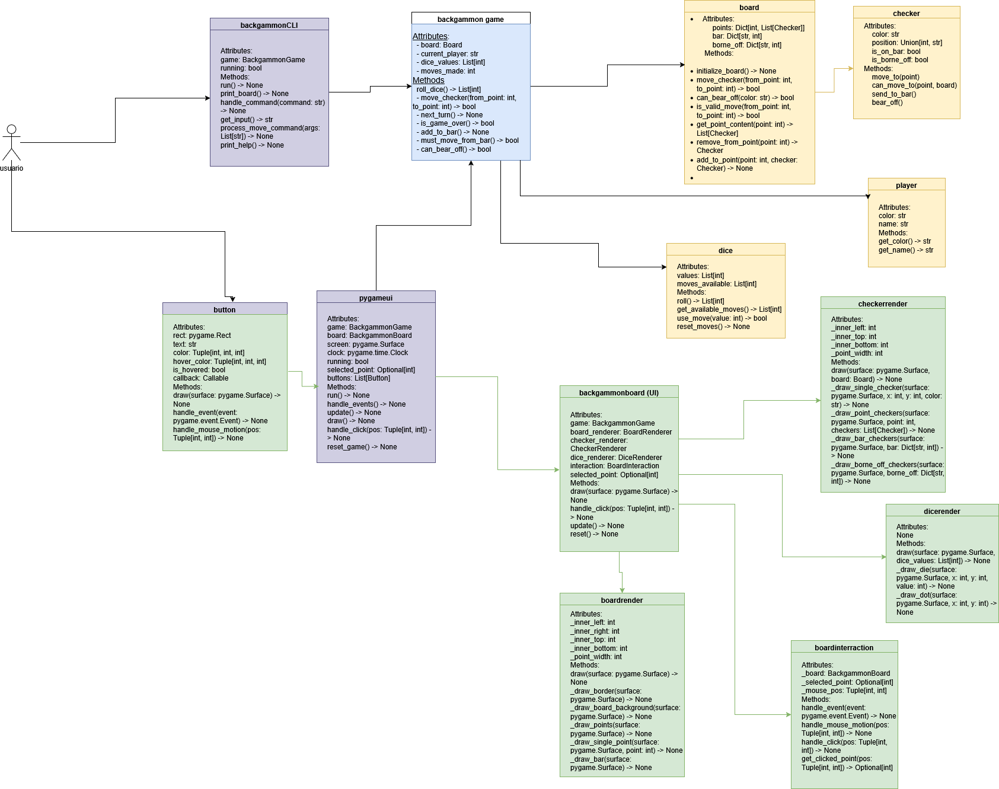

# Juego de Backgammon - Justificación del Diseño

## 1\. Resumen General del Diseño

El proyecto del juego de Backgammon sigue un patrón de diseño modular con una clara separación de responsabilidades, implementando tanto una Interfaz de Línea de Comandos (CLI) como una Interfaz Gráfica de Usuario (GUI) basada en Pygame. La estructura del proyecto se divide en tres componentes principales:

1.  **Lógica Central del Juego** (`core/`)

      - Contiene las mecánicas y reglas fundamentales del juego
      - Independiente de cualquier implementación de interfaz de usuario
      - Incluye clases base para los elementos del juego

2.  **UI con Pygame** (`pygame_ui/`)

      - Maneja toda la renderización gráfica y la interacción con el usuario
      - Separa la lógica de renderización de la gestión del estado del juego
      - Utiliza composición para combinar diferentes componentes de la UI

3.  **Interfaz de Línea de Comandos** (`cli/`)

      - Proporciona interacción con el juego basada en texto
      - Implementa el patrón "command" (comando) para las acciones del usuario
      - Mantiene la separación de la lógica central del juego

## 2\. Justificación de la Selección de Clases

### Clases Centrales (Core)

#### `Game` (BackgammonGame.py)

  - **Responsabilidad**: Coordinador principal del juego
  - **Justificación**:
      - Actúa como el controlador central del estado del juego
      - Gestiona los turnos de los jugadores y el flujo del juego
      - Coordina las interacciones entre el tablero, los dados y los jugadores
      - Implementa las reglas del juego y la validación de movimientos

#### `Board` (board.py)

  - **Responsabilidad**: Gestión del estado del tablero
  - **Justificación**:
      - Mantiene el estado del tablero de juego
      - Maneja la validación del movimiento de las fichas
      - Gestiona la salida de fichas (bearing off) y las fichas en la barra (bar)
      - Proporciona consultas sobre el estado del tablero

#### `Player` (player.py)

  - **Responsabilidad**: Estado y acciones del jugador
  - **Justificación**:
      - Encapsula datos específicos del jugador
      - Gestiona los movimientos y validaciones del jugador
      - Rastrea el progreso del jugador (fichas sacadas, etc.)
      - Maneja reglas específicas del jugador

#### `Checker` (Checker.py)

  - **Responsabilidad**: Representación de piezas individuales
  - **Justificación**:
      - Representa las piezas individuales del juego
      - Rastrea el estado de la pieza (posición, color)
      - Simplifica la gestión y validación de piezas

#### `Dice` (Dice.py)

  - **Responsabilidad**: Mecánicas de lanzamiento de dados
  - **Justificación**:
      - Maneja el lanzamiento de dados y su validación
      - Gestiona la mecánica de lanzamientos dobles
      - Proporciona cálculos del valor del movimiento

### Clases de UI

#### `BackgammonBoard` (pygame\_ui/backgammon\_board.py)

  - **Responsabilidad**: Coordinación de la UI
  - **Justificación**:
      - Sirve de puente entre la lógica del juego y la representación visual
      - Coordina diferentes renderizadores (renderers)
      - Gestiona el estado y las actualizaciones de la UI

## 3\. Justificación de Atributos

### Clase `Game`

  - `board`: Mantiene el estado del juego
  - `dice`: Maneja la generación de movimientos
  - `current_player`: Rastrea el orden de los turnos
  - `players`: Almacena la información de los jugadores

### Clase `Board`

  - `points`: Representación en lista de las posiciones del tablero
  - `bar`: Rastrea las piezas capturadas
  - `borne_off`: Cuenta las piezas retiradas
  - Justificación: Estado mínimo necesario para la representación completa del juego

### Clase `Player`

  - `name`: Identificación del jugador
  - `color`: Color de las piezas del jugador
  - `pieces_in_home_board`: Para la validación de la salida de fichas (bearing off)
  - `pieces_on_bar`: Rastrea las piezas capturadas
  - Justificación: Estado esencial del jugador para las reglas del juego

## 4\. Decisiones de Diseño Relevantes

1.  **Separación de la Lógica Central (Core) y la Lógica de UI**

      - La lógica central del juego es independiente de la UI
      - Permite múltiples implementaciones de interfaz
      - Facilita las pruebas y el mantenimiento

2.  **Uso de "Type Hints" (Indicaciones de Tipo)**

      - Mejora la legibilidad del código
      - Permite un mejor soporte del IDE
      - Ayuda a detectar errores relacionados con tipos de forma temprana

3.  **Estado de Juego Inmutable**

      - El estado del tablero cambia a través de métodos controlados
      - Previene modificaciones de estado inválidas
      - Simplifica la depuración y las pruebas

## 5\. Manejo de Excepciones y Gestión de Errores

1.  **Excepciones Personalizadas**

      - `ValueError` para colores/posiciones inválidas
      - Mensajes de error claros para la depuración
      - Validación adecuada de todas las entradas

2.  **Validación de Movimientos**

      - Prevalidación de todos los movimientos
      - Indicadores claros de fallo
      - Transiciones de estado seguras

## 6\. Estrategia de Pruebas (Testing) y Cobertura

1.  **Pruebas Unitarias**

      - Casos de prueba exhaustivos para cada clase
      - Cobertura de casos límite (edge cases)
      - Pruebas de transición de estado
      - Pruebas de validación de movimientos

2.  **Categorías de Pruebas**

      - Pruebas de inicialización
      - Pruebas de modificación de estado
      - Pruebas de validación de reglas
      - Pruebas de interacción de UI

3.  **Objetivos de Cobertura**

      - Cobertura de código mínima del 90%
      - Pruebas de la ruta crítica (critical path)
      - Validación de casos límite

## 7\. Cumplimiento de los Principios SOLID

### Principio de Responsabilidad Única (SRP)

  - Cada clase tiene un propósito único y bien definido
  - Lógica de UI separada de la lógica del juego
  - Clara separación de responsabilidades

### Principio de Abierto/Cerrado (OCP)

  - Se pueden agregar nuevas implementaciones de UI sin modificar la lógica central
  - El sistema de renderizadores (renderer) es extensible
  - Las reglas del juego se pueden extender sin cambios en el núcleo

### Principio de Sustitución de Liskov (LSP)

  - Las implementaciones de UI son intercambiables
  - Los tipos de `Player` (jugador) podrían extenderse (IA vs. Humano)
  - Uso consistente de la interfaz

### Principio de Segregación de Interfaces (ISP)

  - Interfaces mínimas requeridas
  - Los componentes de la UI solo dependen de los métodos necesarios
  - Clara separación de las responsabilidades de renderización

### Principio de Inversión de Dependencias (DIP)

  - La lógica central no depende de la implementación de la UI
  - Los módulos de alto nivel definen las interfaces
  - Fácil de agregar nuevas implementaciones de UI

## 8\. Diagrama de Clases UML

(mirar en modo claro)